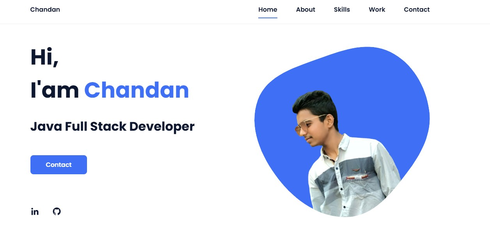

# 💼 Responsive Portfolio Website

A fully responsive personal portfolio website built using **HTML, CSS, and JavaScript**.

---

## 📌 Features

- ✅ Fully responsive design (Mobile First)
- 🎨 Beautiful and modern UI
- ⚙️ Smooth scroll & scroll animations
- 💼 Sections: Home, About, Skills, Work, Contact
- 💻 Built with HTML5, CSS3, and JavaScript
- 🔒 Clean and secure code structure
- 🌐 Compatible with all modern browsers

---

## 🧑‍💻 Author

**Chandan Shaha**  
💼 Java Full Stack Developer  
📎 [LinkedIn](https://www.linkedin.com/in/chandan-shaha-7ba0b921a/)  
🐙 [GitHub](https://github.com/ChandanShaha)

---

## 📂 Folder Structure
portfolio/
├── assets/
│ ├── css/
│ │ └── styles.css
│ ├── img/
│ │ ├── perfil.png
│ │ ├── work1.jpg ... work6.jpg
│ │ └── about.jpg
│ └── js/
│ └── main.js
├── index.html
└── preview.png